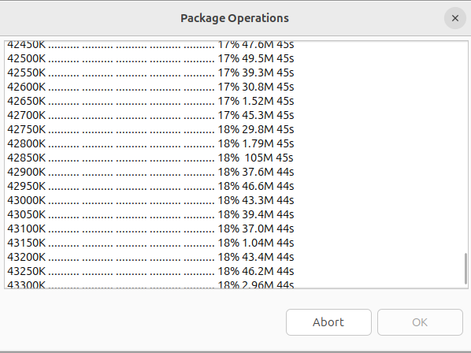
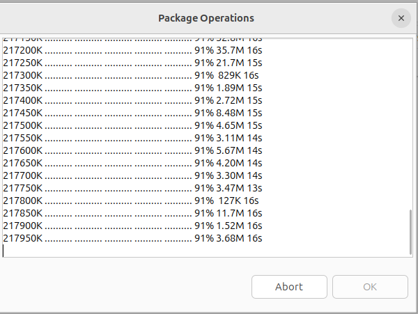

# 安装包

## 操作步骤

1. 点击 RuyiSDK -> Ruyi Package Explorer进入包管理器
2. 选择对应的包进行install/uninstall Packages

## 预期结果

能够正常安装包

## 实际结果

能够正常安装包，但是在安装包时将页面关掉，重新点击Install/Uninstall Packages会显示当前包并未安装，继续显示上一页面的安装进度，最终使得包安装冲突，下载失败

