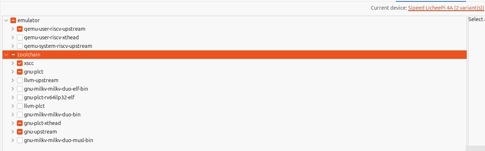

# 开发板型号过滤 Packages
## 操作步骤
1.点击 RuyiSDK -> Package Explorer 
2.current device(none selected)

## 预期结果
打开Package Explorer 时不再强制用户选择开发板，此时列出所有的packages，同时可以在current device选择对应开发板，同时软件包列表会根据选择的开发板进行过滤。

## 实际结果
打开Package Explorer 时不再强制用户选择开发板，此时列出所有的packages，同时可以在current device选择对应开发板，同时软件包列表会根据选择的开发板进行过滤。(只会列出模拟器和工具链，其余image等不会显示)

